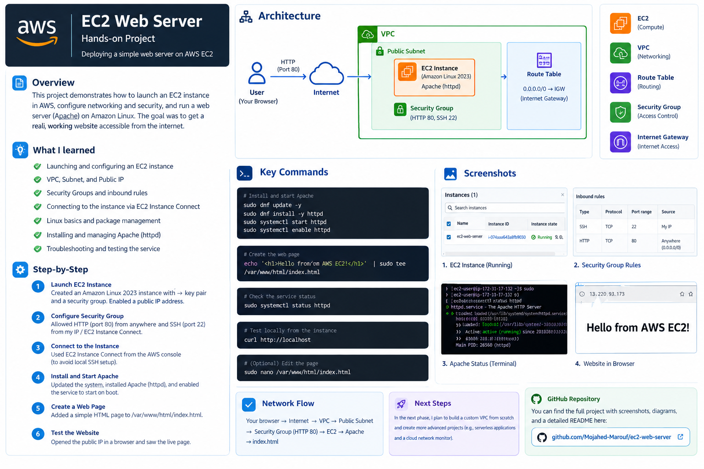
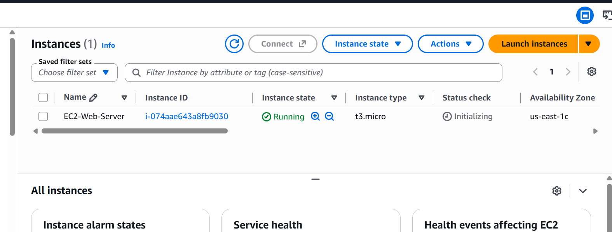
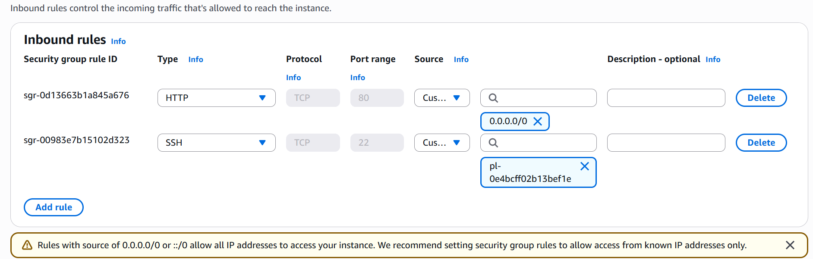
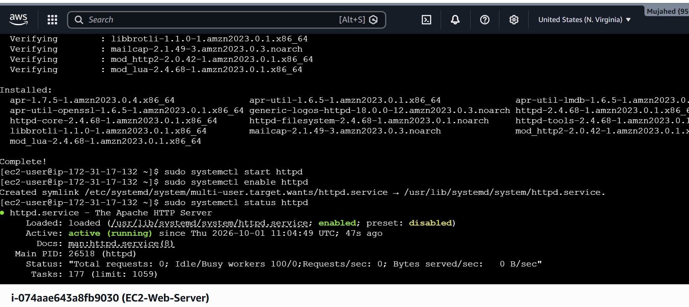
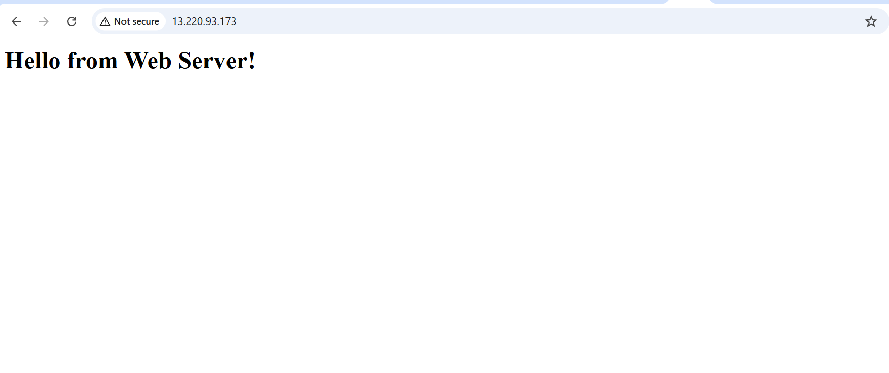

# AWS EC2 Web Server | Hands-on Project

## Project Overview

This project demonstrates the deployment of a web server on Amazon Web Services (AWS) using Amazon EC2 and Apache HTTP Server.

The main objective was to gain practical experience with cloud infrastructure, networking, Linux system administration, and security configuration by deploying a publicly accessible web server.

## Architecture



### Network Flow

```text
User Browser
     |
  Internet
     |
   AWS VPC
     |
 Public Subnet
     |
 Security Group
     |
 EC2 Instance
 (Amazon Linux 2023)
     |
 Apache HTTP Server
     |
   index.html
```

## AWS Services & Technologies

* Amazon EC2
* Amazon VPC (Default VPC)
* Security Groups
* Amazon Linux 2023
* Apache HTTP Server (httpd)
* EC2 Instance Connect
* SSH and HTTP
* Linux Command Line

## Implementation Steps

### 1. Launch EC2 Instance

* Launched an EC2 instance using Amazon Linux 2023.
* Selected an appropriate instance type.
* Configured a key pair.
* Enabled a public IPv4 address.

### 2. Configure Security Group

Configured inbound rules:

| Type | Protocol | Port | Source                              |
| ---- | -------- | ---- | ----------------------------------- |
| SSH  | TCP      | 22   | My IP / EC2 Instance Connect access |
| HTTP | TCP      | 80   | 0.0.0.0/0                           |

### 3. Connect to EC2

Connected to the Linux instance using EC2 Instance Connect through the AWS Management Console.

### 4. Install Apache Web Server

Updated the system and installed Apache:

```bash
sudo dnf update -y
sudo dnf install -y httpd
```

Started and enabled the Apache service:

```bash
sudo systemctl start httpd
sudo systemctl enable httpd
```

### 5. Create a Web Page

Created a simple HTML page:

```bash
echo '<h1>Hello from AWS EC2!</h1>' | sudo tee /var/www/html/index.html
```

### 6. Verify the Web Server

Checked the Apache service:

```bash
sudo systemctl status httpd
```

Tested the web server locally:

```bash
curl http://localhost
```

Finally, accessed the website through the EC2 public IPv4 address using a web browser.

## Project Screenshots

### EC2 Instance



### Security Group Configuration



### Apache Service Status



### Deployed Website



## Key Learning Outcomes

Through this project, I gained practical experience in:

* Launching and configuring Amazon EC2 instances.
* Understanding VPCs and public subnets.
* Working with public and private IP addresses.
* Configuring Security Groups and inbound traffic rules.
* Understanding SSH and HTTP protocols.
* Connecting to Linux instances through EC2 Instance Connect.
* Installing and managing Apache HTTP Server.
* Using Linux commands and package management.
* Performing basic troubleshooting and service verification.
* Understanding how web traffic reaches an application hosted in AWS.

## Challenges & Troubleshooting

During the deployment, I worked through SSH connectivity issues and learned how to troubleshoot instance access and security configurations.

I also encountered a Bash command-line issue while creating the HTML page and resolved it by adjusting the command syntax.

These troubleshooting steps helped me better understand the relationship between cloud networking, security rules, and Linux administration.

## Future Improvements

* Build a custom VPC from scratch.
* Configure public and private subnets.
* Explore NAT Gateway and Internet Gateway routing.
* Implement HTTPS using SSL/TLS.
* Configure CloudWatch monitoring.
* Explore Application Load Balancers.
* Automate infrastructure deployment using Terraform.

## Conclusion

This project was an important step in transitioning from theoretical AWS knowledge to practical cloud implementation.

It helped me develop a better understanding of AWS infrastructure, networking, security, and Linux-based server management.

**More hands-on cloud and networking projects coming soon!**

---

**Author:** Mujahed Marouf
**Field:** Computer Networks and Security Engineering
**University:** Jordan University of Science and Technology (JUST)
